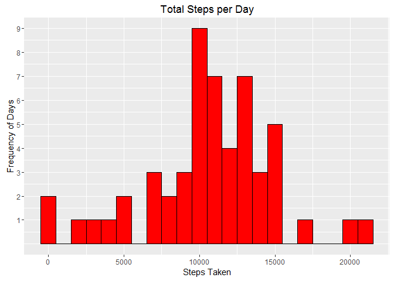
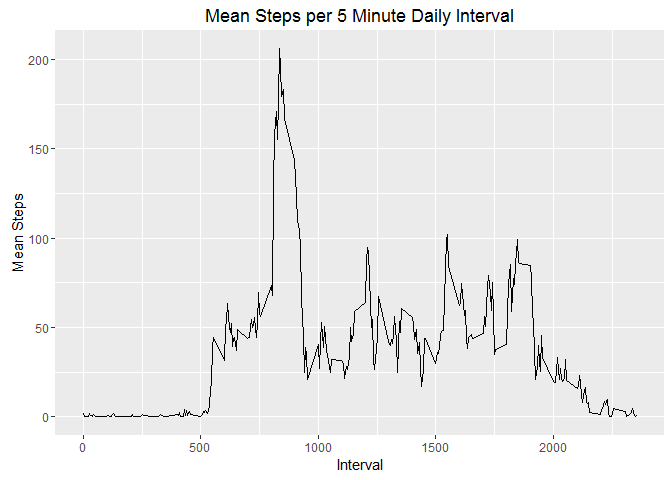
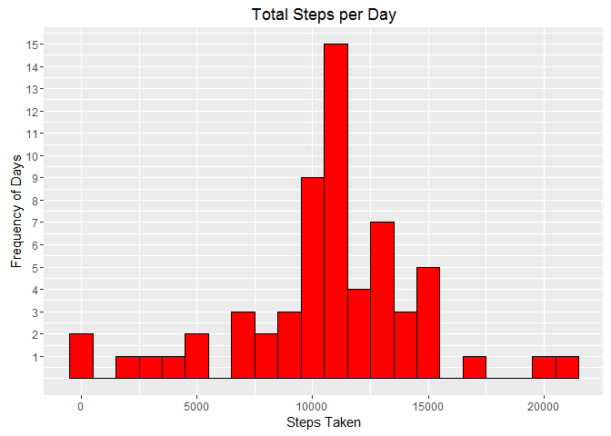
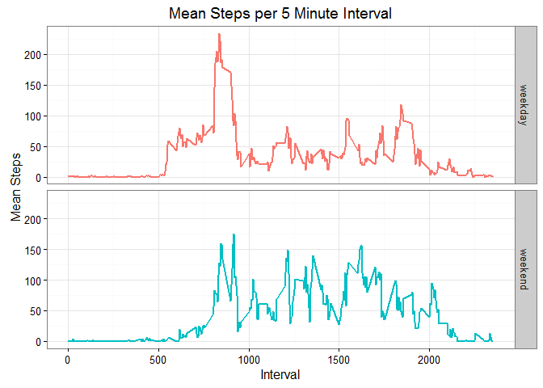

# Reproducible Research: Peer Assessment 1


## Loading and preprocessing the data

```r
library(ggplot2)
library(dplyr)
step_data <- read.csv("activity.csv", header=TRUE)
step_data$date <- as.Date(step_data$date)
```

## What is mean total number of steps taken per day?

```r
steps_by_date <- aggregate(steps ~ date, data = step_data, FUN=sum, na.action=na.pass)
plot1 <- ggplot(steps_by_date, aes(x = steps_by_date$steps)) +
                geom_histogram(binwidth=1000, color="black", fill="red") +
                ggtitle("Total Steps per Day") +
                xlab("Steps Taken") +
                ylab("Frequency of Days") +
                scale_y_continuous(breaks=1:9)
print(plot1)
```

<!-- -->

```r
options(scipen = 10) # Force R not to print using scientific notation here
steps_mean <- mean(steps_by_date$steps, na.rm=TRUE)
steps_median <- median(steps_by_date$steps, na.rm=TRUE)
```
The mean number of steps per day is 10766.1886792 and the median number of steps per day is 10765.

## What is the average daily activity pattern?

```r
steps_by_time <- aggregate(steps~interval, data = step_data, FUN=mean)
plot2 <- ggplot(steps_by_time, aes(x = interval, y = steps)) +
                geom_line() +
                ggtitle("Mean Steps per 5 Minute Daily Interval") +
                xlab("Interval") +
                ylab("Mean Steps")
print(plot2)
```

<!-- -->

```r
max_interval <- steps_by_time[order(steps_by_time$steps, decreasing=TRUE, na.last=TRUE)[1],]
```
The 5 minute interval with the maximum number of steps (averaged across all days) is number 835, with a value of 206.1698113 steps on average.

## Imputing missing values

```r
steps_missing <- sum(is.na(step_data$steps))
#steps_by_date <- aggregate(steps ~ date, data=step_data, FUN=mean, na.rm=TRUE)
dates_missing <- sum(is.na(steps_by_date$steps))
```
The total number of missing step data values is 2304. The total number of days with all step values missing (therefore no daily mean value) is 8.

The following code chunk will fill in each missing interval step datum with the mean of that 5 minute interval over all days.

```r
steps_filled <- merge(step_data, steps_by_time, by="interval", suffixes = c("", "_interval_mean"))
steps_filled[is.na(steps_filled$steps),]$steps <- steps_filled[is.na(steps_filled$steps),]$steps_interval_mean
```
Now we will plot another histogram that shows the same step data as the histogram above but with all missing values imputed.

```r
steps_filled_by_date <- aggregate(steps ~ date, data = steps_filled, FUN=sum)
plot3 <- ggplot(steps_filled_by_date, aes(x = steps_filled_by_date$steps)) +
                geom_histogram(binwidth = 1000, color="black", fill="red") +
                ggtitle("Total Steps per Day") +
                xlab("Steps Taken") +
                ylab("Frequency of Days") +
                scale_y_continuous(breaks=1:15)
print(plot3)
```

<!-- -->

```r
options(scipen = 10) # Force R not to print using scientific notation here
steps_mean <- mean(steps_filled_by_date$steps)
steps_median <- median(steps_filled_by_date$steps)
```
Using the imputed data, the mean number of steps per day is 10766.1886792 and the median number of steps per day is 10766.1886792. The imputed mean is the same as the original mean, but the imputed median has now become equal to the mean (because there were 8 days which were previously not included in the data set that were added in, all with the same imputed data). The histograms appear similar, except that the tallest bin frequency has now increased from 9 to 15, for the same reason that the median changed.

## Are there differences in activity patterns between weekdays and weekends?
Create a new column in the data indicating weekday or weekend. Then create two time series plots comparing the step data for weekdays vs. weekends.

```r
step_data$day_type <- rep('weekday', nrow(step_data))
step_data$day_type[grep('Sat|Sun', weekdays(step_data$date))] <- "weekend"
step_data$day_type <- as.factor(step_data$day_type)

steps_by_day_type <- 
  step_data %>%
  group_by(interval, day_type) %>%
  summarise(mean_steps = mean(steps, na.rm=TRUE))

plot4 <- ggplot(steps_by_day_type) +
                geom_line(aes(interval, mean_steps, color=day_type), size = 1) +
                facet_grid(day_type ~ .) +
                xlab("Interval") +
                ylab("Mean Steps") +
                labs(title="Mean Steps per 5 Minute Interval") +
                theme_bw() +
                theme(legend.position = "none")

print(plot4)
```

<!-- -->

Comparing the time series graphs, the weekends see more periods of high step activity throughout the day than the weekdays. The weekdays, however, see higher peak activity.
